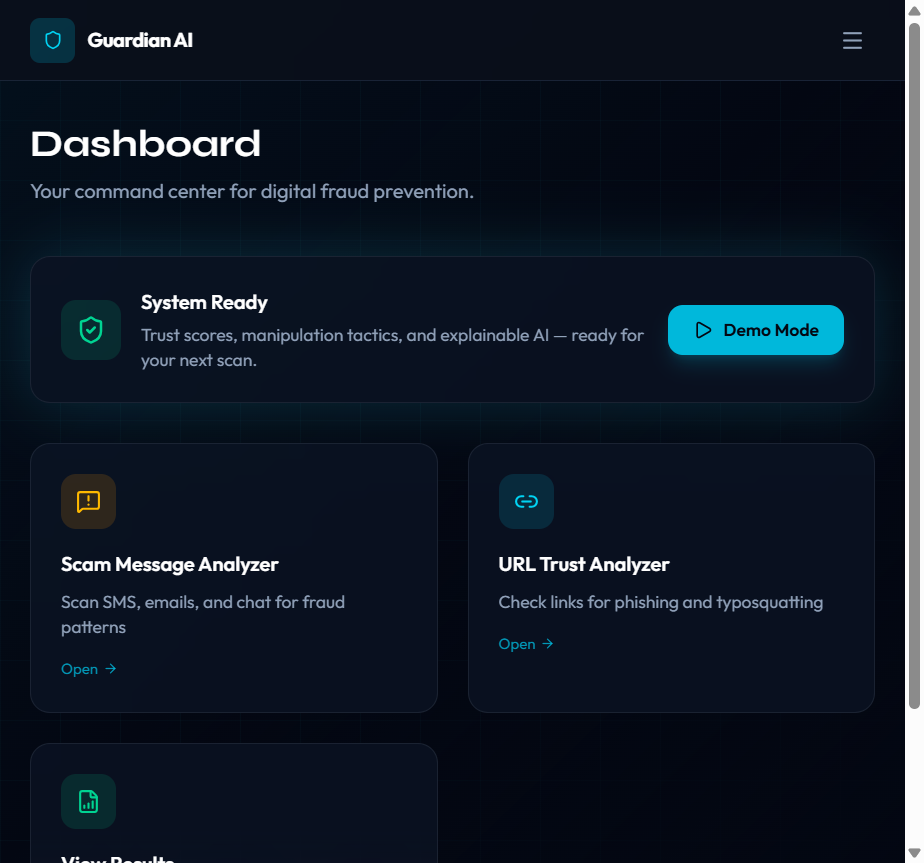
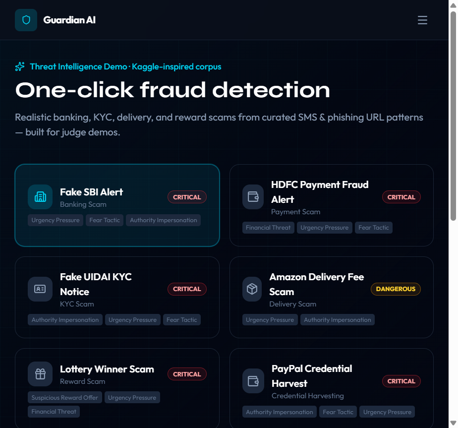
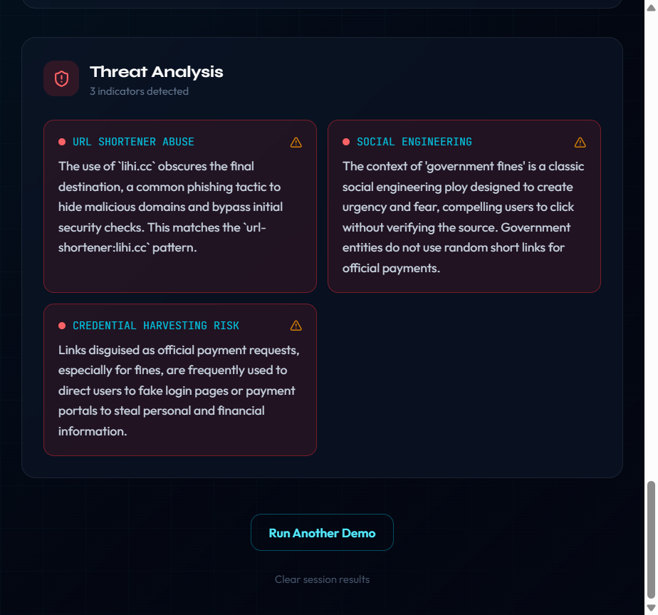

# Guardian AI

> An AI-powered digital trust shield — helping people spot scams before they click, pay, or share.

<p align="center">
  
  
  
  
</p>

---

## The Problem

Online fraud is everywhere — and it’s getting harder to catch.

- Phishing links disguised as banks, delivery apps, and government sites  
- Scam SMS and emails that pressure you to act *right now*  
- Fake websites built to steal passwords and payment details  
- Spoofed senders pretending to be someone you trust  
- AI-generated messages that sound more convincing than ever  

Most people don’t have a security team. They need **instant, plain-language guidance** when something feels off.

---

## Our Solution

**Guardian AI** is a digital safety assistant that analyzes suspicious content and explains the risk in human terms — not security jargon.

We’re building a system that:

- Scores how trustworthy a message or link appears  
- Surfaces hidden red flags users often miss  
- Explains *why* something looks dangerous  
- Offers practical next steps when risk is high  

The goal: make fraud prevention feel as simple as running a spell-check — fast, clear, and trustworthy.

---

## Live demo

| | URL |
|---|-----|
| **App** | https://guardian-ai-olive.vercel.app |
| **API** | https://guardian-ai-production-62fb.up.railway.app |
| **Health** | https://guardian-ai-production-62fb.up.railway.app/api/health |

**Vercel** → `VITE_API_BASE_URL=https://guardian-ai-production-62fb.up.railway.app` (then redeploy)

**Railway** → `FRONTEND_URL=https://guardian-ai-olive.vercel.app,http://localhost:5173` (then redeploy if changed)

See [backend/DEPLOYMENT.md](./backend/DEPLOYMENT.md) for full setup.

---

## Tech Stack

| Layer | Technologies |
|-------|----------------|
| **Frontend** | React, Vite, Tailwind CSS, Framer Motion |
| **Backend** | Node.js, Express |
| **AI** | Google Gemini (via AI Studio) |
| **Deploy** | [Vercel](https://guardian-ai-olive.vercel.app) (frontend), [Railway](https://guardian-ai-production-62fb.up.railway.app) (API) |
| **Optional** | Firebase / Supabase for history & auth |

---

## Architecture

```text
User Input
    ↓
Threat Intelligence Layer
    ↓
Manipulation Detection Engine
    ↓
Gemini AI Analysis
    ↓
Hybrid Trust Score Engine
    ↓
Explainable Threat Report
    ↓
Recovery Guidance
```

Guardian AI combines deterministic threat intelligence with Gemini-powered reasoning to generate explainable, real-time fraud analysis.

---

## What It Does

Guardian AI acts as your **second pair of eyes** on the internet.

Paste something suspicious — a text, email snippet, or URL — and the app helps you decide whether it’s safe to trust. You get a clear trust signal, threat highlights, and an explanation you can actually understand.

**Core capabilities** *(in development)*:

| Feature | Description |
|---------|-------------|
| Scam message analyzer | Detect urgency tricks, impersonation, and common scam patterns |
| URL trust analyzer | Flag risky links and look-alike domains |
| Trust score | Quick at-a-glance safety rating |
| Explainable AI | Plain-language breakdown of what went wrong |
| Recovery guidance | What to do if you may have been targeted |

> We’re iterating phase-by-phase. Not every feature is public yet — follow the repo for updates.

---

## Why Guardian AI Matters

Cybercrime and phishing attacks continue to grow in both frequency and sophistication. Modern scams increasingly use AI-generated content, emotional manipulation, urgency, and impersonation tactics to deceive users.

Guardian AI was created to help everyday users make safer decisions online by providing explainable, human-friendly fraud analysis before they click, pay, or share sensitive information.

Our vision is to make digital trust as accessible and intuitive as spell-checking a document.

---

## Screenshots

### Dashboard

Command center for scam message analysis, URL trust checks, and threat reports.

<p align="center">
  
</p>

### Demo Mode — Kaggle-inspired threat corpus

One-click scans with realistic banking, KYC, delivery, and reward scam examples for hackathon demos.

<p align="center">
  
</p>

### Threat Analysis — RTO / challan scam detection

Real scan results for a suspicious traffic-fine SMS with a `lihi.cc` short link. Guardian AI flags URL shortener abuse, social engineering, and credential harvesting risk.

<p align="center">
  
</p>

<p align="center">
  <sub>Dashboard → Demo Mode → Live threat analysis · hybrid AI + pattern intelligence</sub>
</p>

---

## Getting Started

<details>
<summary><strong>Local setup (contributors)</strong></summary>

<br>

1. Get a Gemini API key from [Google AI Studio](https://aistudio.google.com/apikey)

2. Configure the backend:

```bash
cd backend
cp .env.example .env
# Set GEMINI_API_KEY=your_key
```

3. Install and run (from project root):

```bash
npm install
npm run install:all
npm run dev
```

**Or run separately:**

```bash
npm run dev:backend   # http://localhost:3001
npm run dev:frontend  # http://localhost:5173
```

- App: http://localhost:5173  
- API health: http://localhost:3001/api/health  

See [STRUCTURE.md](./STRUCTURE.md) for full folder layout.

</details>

---

## Contributing

Contributions are welcome — especially during hackathon season.

1. **Fork** the repository  
2. **Create** a branch: `git checkout -b feature/your-feature`  
3. **Commit** your changes with a clear message  
4. **Push** and open a **Pull Request**

### Guidelines

- Keep PRs focused — one feature or fix per PR  
- Match existing code style (modular components, clean API layer)  
- Do **not** commit secrets (`.env`, API keys)  
- Update README screenshots if you change the UI significantly  

### Ideas to contribute

- UI polish and accessibility  
- Additional scam pattern detection  
- Scan history & export  
- Deployment configs (Vercel, Railway, etc.)  
- Tests for API validation  

Questions or ideas? Open an [issue](https://github.com/mohit200008/guardian-ai/issues).

---

## AI Tools & Development Workflow

Guardian AI was developed during the Microsoft Build AI Hackathon using modern AI-assisted engineering workflows.

### AI Tools Used

- GitHub Copilot for code suggestions, prototyping, and developer productivity
- Cursor AI for code generation, debugging, refactoring, documentation, and rapid iteration
- Google Gemini 2.5 Flash for scam reasoning, risk analysis, and explainable threat reports

### Human Engineering Contributions

While AI tools accelerated development, all major decisions regarding:

- System architecture
- Threat intelligence design
- Trust score methodology
- Scam detection logic
- UI/UX design
- Deployment architecture
- Product strategy

were designed, implemented, tested, and validated by the development team.

Guardian AI demonstrates how AI-assisted development combined with human judgment can be used to build practical, production-ready cybersecurity solutions.

---

## License

MIT — built for learning and hackathon use.

---

<p align="center">
  <strong>Guardian AI</strong> — because everyone deserves a digital trust shield.
</p>

<p align="center">
  <sub>Built by <strong>Mohit Lamba</strong></sub>
</p>
